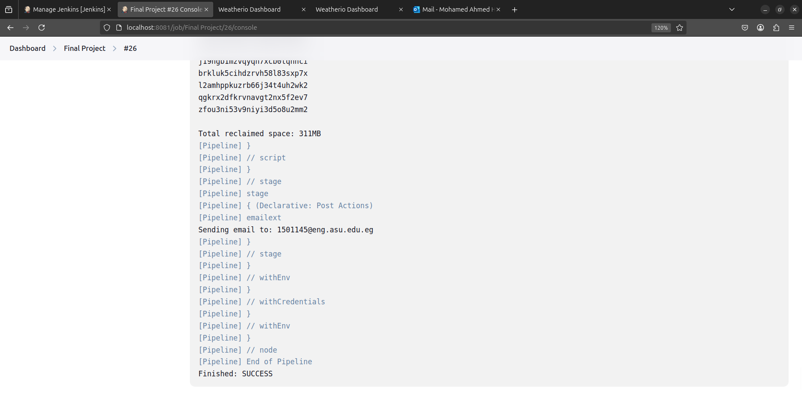
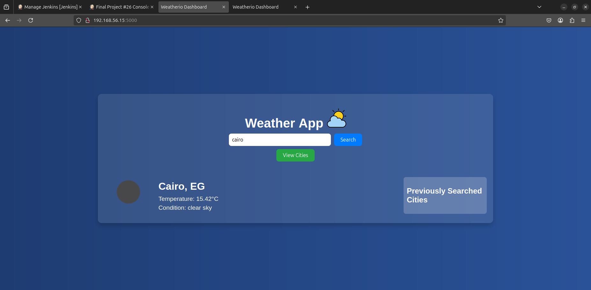
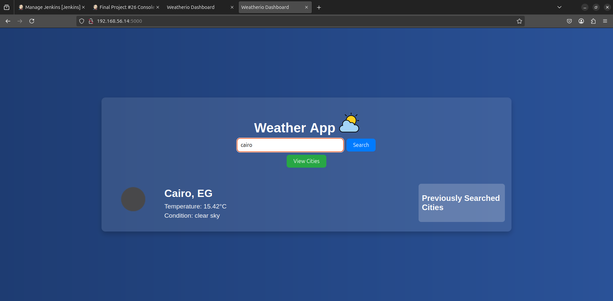
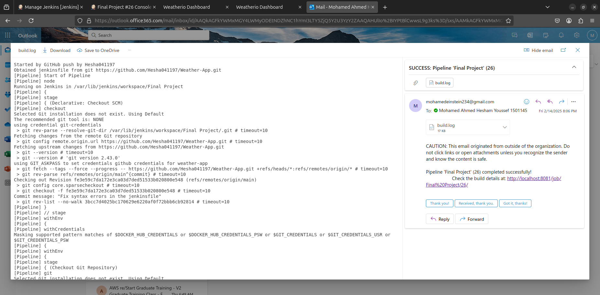

# Weather App Deployment Pipeline

This project automates the deployment of a **Weather App** using a **CI/CD pipeline** powered by **Jenkins**, **Docker**, and **Ansible**. The pipeline builds a Docker image, pushes it to Docker Hub, and deploys the application to target servers using Ansible.

---

## Table of Contents

1. [Project Overview](#project-overview)
2. [Technologies Used](#technologies-used)
3. [Prerequisites](#prerequisites)
4. [Setup Instructions](#setup-instructions)
   - [Jenkins Pipeline Setup](#jenkins-pipeline-setup)
   - [Ansible Inventory Configuration](#ansible-inventory-configuration)
   - [Docker Hub Configuration](#docker-hub-configuration)
   - [Email Notifications](#email-notifications)
   - [GitHub Push Trigger](#github-push-trigger)
5. [Pipeline Workflow](#pipeline-workflow)
6. [Usage](#usage)
7. [Troubleshooting](#troubleshooting)
8. [Contributing](#contributing)
9. [License](#license)

---

## Project Overview

This project demonstrates a **CI/CD pipeline** for deploying a **Weather App**. The pipeline performs the following tasks:

1. **Pull Code**: Fetches the latest code from a Git repository.
2. **Build Docker Image**: Builds a Docker image for the Weather App.
3. **Push to Docker Hub**: Pushes the Docker image to Docker Hub.
4. **Deploy with Ansible**: Deploys the Docker image to target servers using Ansible.
5. **Cleanup**: Removes unused Docker resources to free up disk space.
6. **Email Notifications**: Sends email notifications on pipeline success or failure.
7. **GitHub Push Trigger**: Automatically triggers the pipeline on any push to the GitHub repository.

---

## Technologies Used

- **Jenkins**: CI/CD automation server.
- **Docker**: Containerization platform.
- **Ansible**: Configuration management and deployment tool.
- **Vagrant**: For creating and managing virtual machines.
- **Git**: Version control system.
- **CentOS**: Operating system for target servers.

---

## Prerequisites

Before setting up the project, ensure the following are installed and configured:

1. **Jenkins**:
   - Jenkins server with the following plugins installed:
     - Git
     - Docker Pipeline
     - Credentials Binding
     - Email Extension Plugin
     - GitHub Plugin

2. **Docker**:
   - Docker installed on the Jenkins agent and target servers.

3. **Ansible**:
   - Ansible installed on the Jenkins agent.

4. **Vagrant**:
   - Vagrant installed for creating and managing virtual machines.

5. **Git Repository**:
   - A Git repository containing the Weather App code and Ansible playbook.

6. **Docker Hub Account**:
   - A Docker Hub account for pushing Docker images.

7. **SMTP Server**:
   - Access to an SMTP server for sending email notifications (e.g., Gmail, Outlook).

---

## Setup Instructions

### Jenkins Pipeline Setup

1. **Create a Jenkins Pipeline**:
   - Create a new pipeline job in Jenkins.
   - Use the provided `Jenkinsfile` as the pipeline script.

2. **Add Credentials**:
   - Add the following credentials in Jenkins:
     - **Git Credentials**: For accessing the Git repository.
     - **Docker Hub Credentials**: For pushing Docker images to Docker Hub.
     - **SMTP Credentials**: For sending email notifications.

3. **Configure Environment Variables**:
   - Set the following environment variables in the pipeline:
     - `DOCKER_IMAGE_NAME`: Name of the Docker image (e.g., `kryllion/weather-app`).
     - `DOCKER_IMAGE_TAG`: Tag for the Docker image (e.g., `latest`).
     - `ANSIBLE_INVENTORY`: Path to the Ansible inventory file (e.g., `inventory`).

---

### Ansible Inventory Configuration

1. **Create an Inventory File**:
   - Create an `inventory` file with the following content:
     ```ini
     [webservers]
     192.168.56.15 ansible_user=vagrant ansible_private_key_file=./private_keys/m01/private_key
     192.168.56.14 ansible_user=vagrant ansible_private_key_file=./private_keys/m02/private_key
     ```

2. **Set Private Key Permissions**:
   - Ensure the private key files have the correct permissions (`600`):
     ```bash
     chmod 600 ./private_keys/m01/private_key
     chmod 600 ./private_keys/m02/private_key
     ```

---

### Docker Hub Configuration

1. **Log in to Docker Hub**:
   - Log in to Docker Hub using the Jenkins pipeline:
     ```bash
     echo $DOCKER_HUB_PASSWORD | docker login -u $DOCKER_HUB_USERNAME --password-stdin
     ```

2. **Push Docker Image**:
   - The pipeline will automatically push the Docker image to Docker Hub.

---

### Email Notifications

1. **Install Email Extension Plugin**:
   - Go to **Jenkins > Manage Jenkins > Manage Plugins**.
   - Install the **Email Extension Plugin**.

2. **Configure SMTP Server**:
   - Go to **Jenkins > Manage Jenkins > Configure System**.
   - Scroll down to the **Extended E-mail Notification** section.
   - Configure the SMTP server settings (e.g., Gmail SMTP).

3. **Add Email Notifications to Pipeline**:
   - The `Jenkinsfile` includes email notifications for pipeline success and failure.

---

### GitHub Push Trigger

1. **Install GitHub Plugin**:
   - Go to **Jenkins > Manage Jenkins > Manage Plugins**.
   - Install the **GitHub Plugin**.

2. **Configure GitHub Webhook**:
   - Go to your GitHub repository settings.
   - Add a webhook with the following details:
     - **Payload URL**: `http://<your-jenkins-server>/github-webhook/`
     - **Content type**: `application/json`
     - **Secret**: (Optional) Add a secret for secure communication.
     - **Events**: Select **Just the push event**.

3. **Enable GitHub Trigger in Pipeline**:
   - The `Jenkinsfile` includes a `triggers` block to enable GitHub push triggers.

---

## Pipeline Workflow

The Jenkins pipeline consists of the following stages:

1. **Checkout Git Repository**:
   - Pulls the latest code from the Git repository.

2. **Build Docker Image**:
   - Builds a Docker image for the Weather App.

3. **Push Docker Image**:
   - Pushes the Docker image to Docker Hub.

4. **Run Ansible Playbook**:
   - Deploys the Docker image to target servers using Ansible.

5. **Cleanup**:
   - Removes unused Docker resources.

6. **Email Notifications**:
   - Sends email notifications on pipeline success or failure.

---

## Usage

1. **Trigger the Pipeline**:
   - Manually trigger the pipeline in Jenkins or configure it to trigger automatically on code changes.

2. **Monitor the Pipeline**:
   - Monitor the pipeline execution in the Jenkins dashboard.
   

3. **Verify Deployment**:
   - Verify the Weather App is running on the target servers:
     ```bash
     curl http://192.168.56.15:5000
     curl http://192.168.56.14:5000
     ```
     
     
     

4. **Email Notifications**:
   - Check your email inbox for success or failure notifications.
   

---

## Troubleshooting

### Common Issues

1. **SSH Permission Denied**:
   - Ensure the private key files have the correct permissions (`600`).
   - Verify the private key files are correctly configured in the Ansible inventory.

2. **Docker Login Failed**:
   - Ensure the Docker Hub credentials are correct and have the necessary permissions.

3. **Ansible Playbook Failed**:
   - Check the Ansible playbook logs for errors.
   - Ensure the target servers are reachable and have Docker installed.

4. **Email Notifications Not Sent**:
   - Verify the SMTP server configuration in Jenkins.
   - Check the Jenkins logs for email-related errors.

5. **GitHub Push Trigger Not Working**:
   - Ensure the GitHub webhook is correctly configured.
   - Verify the Jenkins GitHub plugin is installed and configured.

---

## Contributing

Contributions are welcome! Please follow these steps:

1. Fork the repository.
2. Create a new branch for your feature or bugfix.
3. Submit a pull request with a detailed description of your changes.

---

## License

This project is licensed under the **MIT License**. See the [LICENSE](LICENSE) file for details.

---

## Contact

For questions or feedback, please contact:

- **Name**: Muhammad Ahmad Hesham
- **Email**: 1501145@eng.asu.edu.eg
- **GitHub**: [Hesha041197](https://github.com/Hesha041197)
